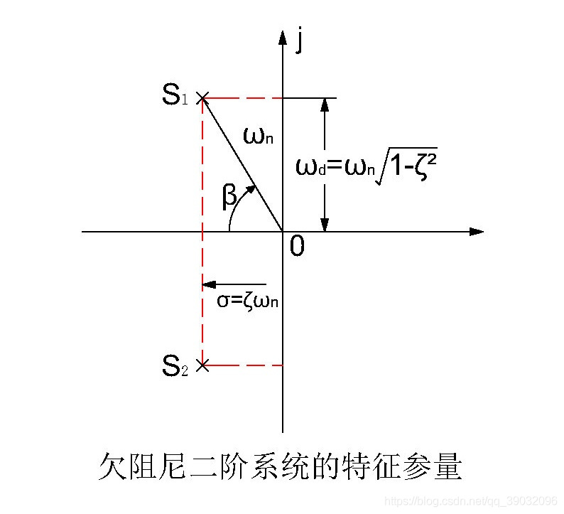

# 二阶系统动态响应特性与阻尼比的关系

胡寿松《自动控制原理》中第75-77页，介绍了欠阻尼二阶系统的动态过程。

## 无零点二阶系统传递函数

无零点二阶系统闭环传递函数如下：

$$
\varPhi(s)=\frac{C(s)}{R(s)}=
\frac{\omega_n^2}{s^2+2\zeta \omega_n s+\omega_n^2}
$$

单位负反馈下对应开环传递函数

$$
G(s)=\frac{\omega_n^2}{s(s+2\zeta)}
$$

其中，常用参数如下，他们的关系如下图

- $\omega_n$称为自然频率
- $\zeta$称为阻尼比
- $\zeta=\cos(\beta)$,$\beta$称为阻尼角
- $\omega_d=\omega_n\sin\beta=\omega_n\sqrt{1-\zeta^2}$称为阻尼振荡角频率
- $\sigma=\omega_n\cos\beta=\omega_n\zeta$称为衰减系数

## 欠阻尼下阶跃响应动态特性

当$0<\zeta<1$时，系统称为欠阻尼二阶系统，它的动态性能参数可以通过这些公式确定。

- 与阻尼比正相关
  - 上升时间：$t_r=\frac{\pi-\beta}{\omega_d}$
  - 峰值时间：$t_p=\frac{\pi}{\omega_d}$
- 与阻尼比负相关
  - 超调量：$\sigma \% = e^{\frac{-\pi\zeta}{\sqrt{1-\zeta^2}}}\times 100\%$
  - 调节时间：
    - $t_s=\frac{3.5}{\sigma}$($\Delta=0.05$)
    - $t_s=\frac{4.4}{\sigma}$($\Delta=0.02$)

## 总结

当自然频率$\omega_n$一定的时候

- 当阻尼比$\zeta$较大时,$\sigma$也就较大，准确性提高，快速性下降
- 当阻尼比较小时，$\omega_d$就变大，快速性变好，准确性下降

### 附：相关性能指标定义（来自matlab）

- 上升时间 `RiseTime` — Time it takes for the response to rise from 10% to 90% of the steady-state response.
- 调节时间 `SettlingTime` — Time it takes for the error $e(t) = |y(t) – yfinal|$ between the response y(t) and the steady-state response yfinal to fall below 2% of the peak value of e(t).
- `SettlingMin` — Minimum value of y(t) once the response has risen.
- `SettlingMax` — Maximum value of y(t) once the response has risen.
- 超调量 `Overshoot` — Percentage overshoot, relative to yfinal).
- `Undershoot` — Percentage undershoot.
- `Peak` — Peak absolute value of y(t)
- 峰值时间 `PeakTime` — Time at which the peak value occurs.

### Code

- [matlab App](MatlabApp/second_order_system_analysis.mlapp)
- [matlab live script](secondsystem.mlx)
- [nodejs script](compute.js)