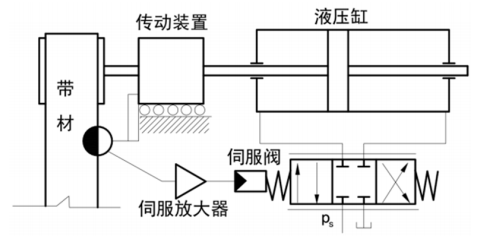
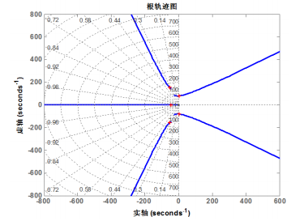
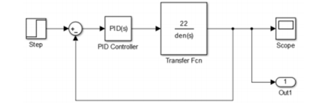
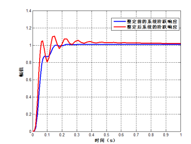

# 模拟进化计算在控制系统中的应用案例分析

## 一、问题背景分析

皮带跑偏会给工程带来严重的危险，甚至发生事故，严重影响生产效率。
通过研究皮带跑偏控制系统工作原理，并在原系统上加入PID控制器，应用差分进化算法调整PID参数。
利用 MATLAB 对控制系统建模仿真的结果表明改进后，
系统稳定性好，而且无超调现象，对于解决了皮带跑偏问题，增加皮带的使用寿命，
避免皮带输送机运转过程中重大事故的发生具有非常重要的实践指导意义。

## 二、系统结构

皮带跑偏控制系统如图 1 所示。
为了使控制系统有更好的控制性能，在原有基础上采用了 PID 控制器，
并采用差分进化算法对皮带跑偏 PID 控制系统的参数进行优化，以达到改善控制系统的性能的目的。
控制系统采用位置反馈闭环控制，光电检测器检测皮带的偏移量。
皮带偏移时，光电检测器输出响应的电压偏差信号，该信号经伺服放大器输送给伺服阀，
伺服阀阀芯产生相应位移，改变流入阀控液压缸两腔压力，使得液压缸的活塞向纠正方向移动，使卷筒处于中心位置。

通过分析可以建立整个系统的数学模型，得到系统的开环传递函数和闭环传递函数：

$$
G(s)=\frac{K_v}{
    s
    (\frac{s^2}{\omega_{sv}^2}+\frac{2\xi_{sv}}{\omega_{sv}}+1)
    (\frac{s^2}{\omega_{n}^2}+\frac{2\xi_n}{{\omega_n}}+1)
    }
$$

其中：

- $K_{v}=1.96\times10^{-3} m^3/A\cdot s$为伺服阀空载平均浏览增益
- $\omega_{sv}=157rad/s$ ，$\xi_{sv}=0.7$

## 三、技术原理

确定参数 $k_{p}$ 大致范围，利用迭代法进行计算得迭代法最大迭代次数 G。

$$
x_{i j}(0)=\operatorname{rand}_{i j}(0,1)\left(x_{i j}^{U}-x_{i j}^{L}\right)+x_{i j}^{L}
$$
式中: $x_{i j}^{U}$ 为第 $\mathrm{i}$ 个个体的第 $\mathrm{j}$ 个染色体上界; $x_{i}^{L}$ 为第 个个体的第 $\mathrm{j}$ 个染色体下较为合适。
$$
x_{i j}(t+1)=\left\{\begin{array}{l}
v_{i}(t+1), f\left(v_{i 1}(t+1), \ldots, v_{i n}(t+1)<x_{i 1}(t), \ldots, x_{i n}(t)\right) \\
x_{i j}(t), f\left(v_{i 1}(t+1), \ldots, v_{i n}(t+1) \geq x_{i n}(t), \ldots, x_{i n}(t)\right)
\end{array}\right.
$$
式中: $w_{1}$ 、 3为目标函数权系数。 采样时间为 $1 \mathrm{~ms}$, 为了避免控制系统发生超调，以超调量 作为界; $\operatorname{rand}_{\tilde{j}}(0,1)$ 为在区间 $[0,1]$ 中随机取数。
$$
h_{\tilde{g}}(t+1)=x_{p 1 j}(t)+F\left(x_{p 2 j}(t)-x_{p 3 j}(y)\right.
$$
式中: $x_{p 2 j}(t)-x_{p 3 j}(t)$ 为差异化向量; $\mathrm{F}$ 为变异因子，通常 取值在 $0 \sim 2$ 。
$$
v_{i j}(t+1)=\left\{\begin{array}{lll}
h_{i j}(t+1), & \text { rand } & l_{i j} \leq C R \\
x_{i j}(t) & , \text { rand } & l_{i j}>C R
\end{array}\right.
$$

式中: $\mathrm{CR}$ 为交叉因子, $0 \leqslant \mathrm{CR} \leqslant 1$ 。 $\mathrm{CR}$ 取值在 $0.6 \sim 0.9$
二项优化指标，确定了目标函数。

## 四、工作过程

Ziegler-Nichols 基于稳定性分析的频域响应确定参数，
根据被控对象传递函数的根轨迹图得到穿越 jω 轴的点。经
计算得： 

伺服阀压力增益:

$k_{p}=0.6 k_{m}=0.8942$

式中: $k_{m}$ 为 $1.8975$ 。

液压缸流量增益:

$k_{i}=\frac{k p \pi}{4 \omega_{m}}=-0.0045$

式中: $\omega_{m}$ 为 $-155.96$ 。 

光电检测器增益:

$k_{d}=\frac{k_{p} \omega_{m}}{\pi}=-4.4$

编写 MATLAB程序，利用系统的开环传递函数确定增益 k_m，
振荡频率 ω_m 的值，得到控制系统开环传递函数的根轨迹图，
如图 3 所示

利用差分进化算法对 PID 参数进行优化，取样本个数为 30，变异因子 $\mathrm{F}=0.9$, 交叉因子 $\mathrm{CR}=0.6$ 。参数 $k_{p}$ 取值范围为 $[0,2] 、 k_{i}$ 取值 范围为 $[-1,1]$ 、 $k_{d}$ 取值范围为 $[-50,50]$, 取权系数 $w_{1}$ 为 $0.9$ 、 $w_{2}$ 为 $0.001 、 w_{3}$ 为 10, 最大迭代次数 $\mathrm{G}=50$, 利用 MATLAB/ Simulink 仿真计算得出，如图 4 所示。基于差分进化算法优 化后的 PID 参数: $k_{p}$ 为 $0.7947, k_{i}$ 为 $0.1244, k_{d}$ 为 $-0.0051$ 。

## 五、运行效果

基于差分进化算法优化后的 PID 参数：$ p_k $为 0.7947，$k_i$ 为 0.1244， $k_d$ 为 -0.0051。

系统的阶跃响应无超调现象，由于超调量和响应时间不可兼得，所以减小超调量会延长响应时间，这一点在图上也能体现出来。