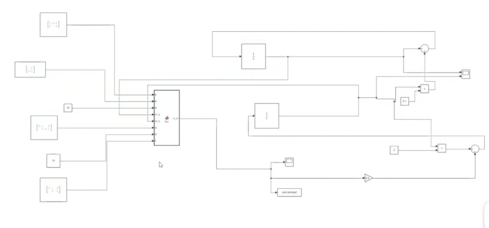

# Model Predictive Control 模型预测控制

代码来自DR_CAN大佬的【MPC模型预测控制器】，有些许修改。

## 哔哩哔哩

- 1_最优化控制和基本概念：[BV1cL411n7KV](https://www.bilibili.com/video/BV1cL411n7KV)
- 2_最优化数学建模推导：[BV1SQ4y1Y7FG](https://www.bilibili.com/video/BV1SQ4y1Y7FG)
- 3_一个详细的建模例子：[BV1Y44y1b7ke](https://www.bilibili.com/video/BV1Y44y1b7ke)
- 4_数学建模推导--Matlab代码详解: [BV1dv411M763](https://www.bilibili.com/video/BV1dv411M763)

