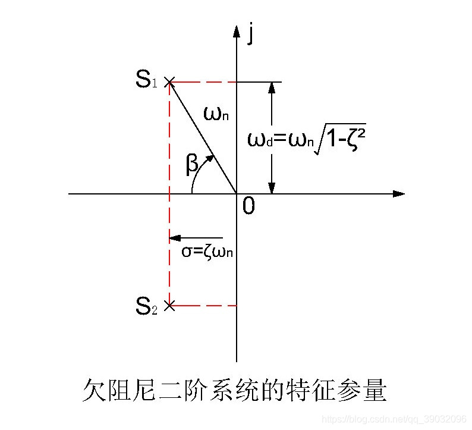
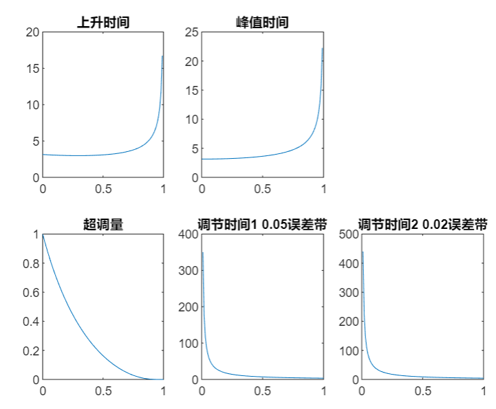

# 二阶系统动态响应特性与阻尼比的关系

胡寿松《自动控制原理》中第75-77页，介绍了欠阻尼二阶系统的动态过程。

## 无零点二阶系统传递函数

无零点二阶系统闭环传递函数：

$$
\varPhi(s)=\frac{C(s)}{R(s)}=
\frac{\omega_n^2}{s^2+2\xi s+\omega_n^2}
$$

单位负反馈下对应开环传递函数

$$
G(s)=\frac{\omega_n^2}{s(s+2\xi)}
$$

其中，常用参数如下，他们的关系如下图

- $\omega_n$称为自然频率
- $\xi$称为阻尼比
- $\xi=\cos(\beta)$,$\beta$称为阻尼角
- $\omega_d=\omega_n\sin\beta=\omega_n\sqrt{1-\xi^2}$
- $\sigma=\omega_n\cos\beta=\omega_n\xi$

## 欠阻尼下阶跃响应动态特性

当$0<\xi<1$时，系统称为欠阻尼二阶系统，它的动态性能参数可以通过这些公式确定。

- 与阻尼比正相关
  - 上升时间：$t_r=\frac{\pi-\beta}{\omega_d}$
  - 峰值时间：$t_p=\frac{\pi}{\omega_d}$
- 与阻尼比负相关
  - 超调量：$\sigma \% = e^{\frac{-\pi\xi}{\sqrt{1-\xi^2}}}\times 100\%$
  - 调节时间：
    - $t_s=\frac{3.5}{\sigma}$($\Delta=0.05$)
    - $t_s=\frac{4.4}{\sigma}$($\Delta=0.02$)

## matlab绘制的动态特性与阻尼比的关系

## 总结

当自然频率$\omega_n$一定的时候

- 当阻尼比$\xi$较大时,$\sigma$也就较大，调节时间和超调量就越小，响应的准确性就越好
- 当阻尼比较小时，$\omega_d$就变大，上升时间和峰值时间就越小，响应的快速性就变好

