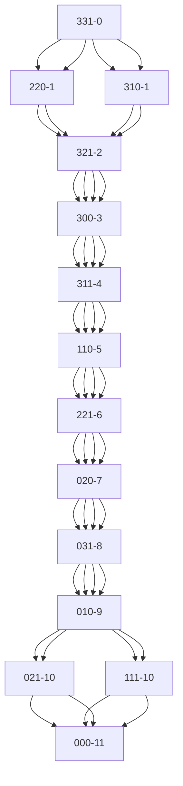

<!-- 3.1.2修道士和野人问题的状态空间补充例2 -->
# 修道士和野人问题

在河的左岸有三个修道士、三个野人和一条船，修道士们想用这条船将所有的人都运过河去，但受到以下条件的限制:

1. 修道士和野人都会划船，但船一次最多只能运两个人;
2. 在任何岸边野人数目都不得超过修道士，否则修道士就会被野人吃掉。

假定野人会服从任何一种过河安排，试规划出一种确保修道士安全过河方案。

## 代码

安装node之后，命令行运行`node main.js 11`可以获得最小的结果,结果将会被写入`mermaid.md` 最短路径长度为11



命令行运行命令`node test.js 21`可以获得，不同路径长度的结果

```plainText
路径长度为11的结果找到了4个
路径长度为13的结果找到了60个
路径长度为15的结果找到了568个
路径长度为17的结果找到了4368个
路径长度为19的结果找到了29892个
```