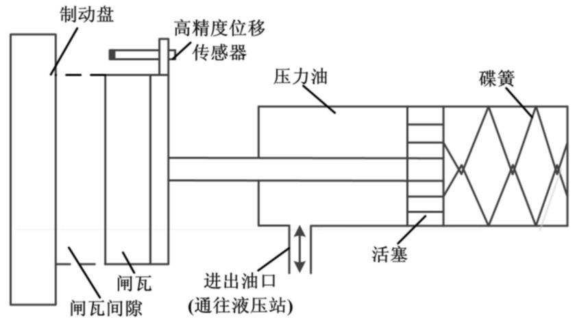
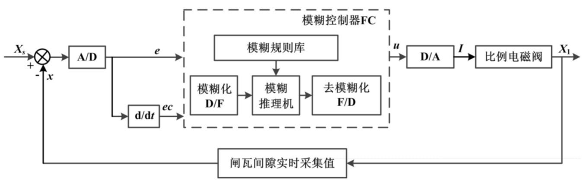
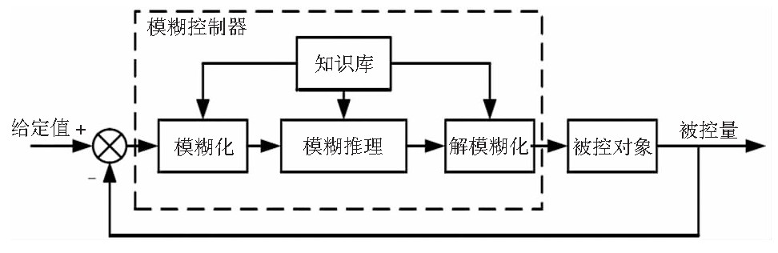
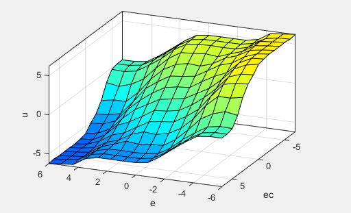
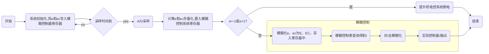
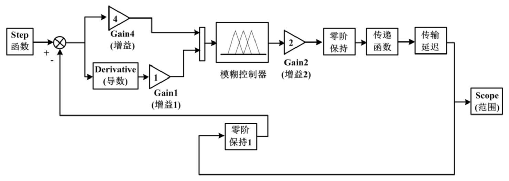
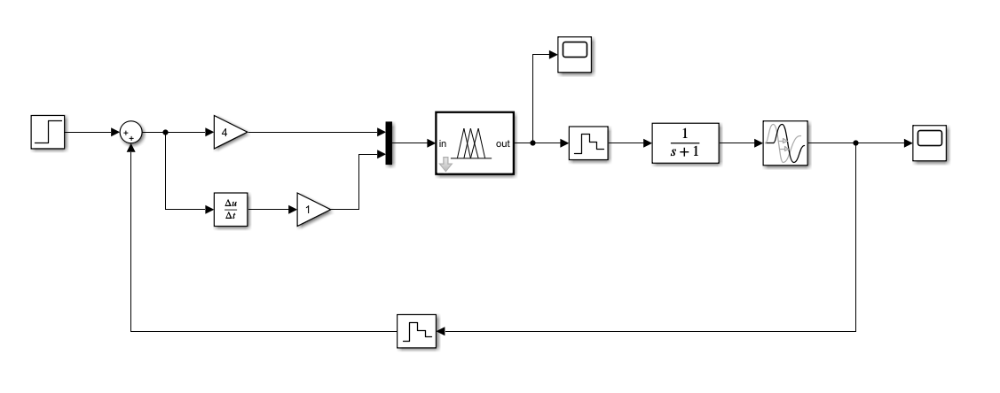
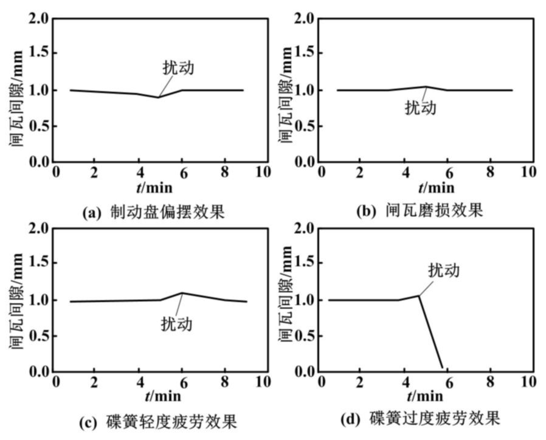

# 模糊控制应用案例分析

## 一、问题背景分析

对于采矿作业来讲，矿矿井提升机是起到了运输人员、物料和矿石作用,连接矿山地面和井下的重要“咽喉设备”。在矿井提升机自动运行过程中,闸瓦间隙受到多种外部扰动的影响,其大小呈不规律变化。

- 过大的间隙会降低制动系统的制动力矩,
- 间隙过小又会造成闸瓦长期刮擦制动盘面。

当前对闸瓦间隙的研究主要集中在间隙的监测,即主要集中在事后管理,虽然能够及时监测到闸瓦间隙的变化并发出报警提示甚至停车,但是不能及时进行间隙大小的自适应调节,往往是故障甚至事故发生后才会对闸瓦间隙进行相应的人工调整。

矿井提升机制动系统硬件部分主要由制动盘、闸瓦、碟簧、活塞、液压站和油管等组成。当提升机在自动运行过程中需要减速时,电控系统控制比例电磁阀电流慢慢减小,油压也同步减小,闸瓦慢慢贴紧到制动盘面。此时,闸瓦间隙值逐渐减小到零当遇到危险情况需要紧急停车时,安全回路失电,比例电磁阀电流归零,同时相应的换向阀动作,压力油迅速回油到液压站,蝶簧推动活塞紧紧抱住制动盘,实现合闸动作。此时,闸瓦间隙值为零。当提升机需要提升物料或人员时,液压站油泵电机启动,压力油克服蝶簧力做功,推动闸瓦脱离制动盘,直到其与制动盘之间的垂直距离达到最大间隙值,从而结束松闸动作。闸瓦工作原理如下图所示。

由图 1 可知,闸瓦间隙$\Delta S$=蝶簧位移$L_1$-闸瓦磨损量$L_2$。蝶簧的位移变化量是非线性的。闸瓦的磨损也具有不可预知性,是一个动态变化量,且蝶簧的疲劳以及制动盘的偏摆也会对闸瓦间隙值构成随机影响。因而很难对闸瓦间隙的位移变化情况建立精确的数学线性模型。

采用传统的智能控制方法很难实现对闸瓦间隙的精确控制。因此,有必要找到一种根据闸瓦间隙变化自动实时控制提升机闸瓦间隙的新型智能控制技术。模糊控制技术非常适合处理这种非线性模糊智能控制系统。

## 二、系统结构

如上图，选取将间隙实测值 $x$ 和间隙设定值$x_s = 1.0 mm$之差$e$作为输入。因为闸瓦间隙$x\in[0,2.0]$，所以 $e\in X_1=[-1,1]$。$e$的变化率$ec =\dot{e}$，它反映了实测间隙值的变化速度和变化方向，$ec\in X_2=[-6,6]$。由于通过调节液压站比例电磁阀的电流可以线性控制压力油的压力，达到控制闸瓦间隙值的目的，因而选取比例电磁阀电流$ I $作为模糊控制器的输出。本研究选用了一个双输入、单输出控制结构。闸瓦间隙模糊控制系统结构如上图所示。

## 三、技术原理

### 模糊控制简介

模糊控制就是以人的模糊推理和决策为依据，通过人为的设计相对应的模糊规则，模糊化处理外界采集的信息，并将之作为输入信号，在控制器中完成推理并将结果录入执行部件，最后得到理想的控制效果。其基本原理图如下

通过制定特定规则，采用不同的语言形式实现模糊控制，参与的专家不同，制定出的规则也不尽相同。但碰到复杂系统时，为更方便创建数学模型，通常采用模糊控制，从而更容易实现更优控制。模糊控制的实现，一般需要现场技术人员的经验知识和现场收集的操作数据。

### 模糊化及隶属函数的选择

设变量 $e$ 为闸瓦间隙实际值与设定值之差的偏差，共有 14 个等级，论域$E=\{-6,-5,-4,-3,-2,-1,-0,+0,1,2,3,4,5,6\}$，偏差 e 模糊化的量化因子选为$k_e = 6$。基于模糊论域 E，分别定义 8 个不同的 模糊子集，每个模糊子集对应一个语言变量: NB(负 大) ，NM(负中) ，NS(负小) ，NO(负零) ，PO(正零) ， PS(正小) ，PM(正中) ，PB(正大) 。

将 $ec$ 的模糊论域 选为 $EC=\{-6,-5,-4,-3,-2,-1,0,1,2,3,4,5,6\}$，偏差变化率 $ec$ 的量化因子为 $k_{ec} = 6$。$I$的模糊论域为$I = \{ -7,-6,-5,-4,-3,-2,-1,0,1,2,3,4,5,6,7\}$。在论域 EC 和 I 上定义 7 个模糊子集且分别 对应 7 个 语 言 变 量: NB(负 大) ，NM(负 中) ，NS (负小) ，O( 零) ，PS(正小) ，PM(正中) ，PB(正大) 。

为了 达到更为精确的控制效果，根据本系统的特点，选择了连续型高分辨率高斯型作为输入输出模糊子集的隶度函数，即$\mu (x) =e^{- \frac{(x-c)^2}{\sigma^2}}$。

### 模糊规则的确定

选择 *Mamdani* 型模糊推理作为本模糊控制器的模糊控制规则，根据提升机司机操作经验和相关专家知识，建立模糊控制规则如下所示。

- R 1: If E is NB ( 负大) and EC is NB( 负大) then I is PB( 正大)
- ……
- R 54: If E is PS( 正小) and EC is PS( 正小) then I is NM( 负中)
- R 55: If E is PM( 正中) and EC is PM ( 正中) then I is NB( 负大)
- R 56: If E is PB( 正大) and EC is PB ( 正大) then I is NB( 负大)

上述第一条控制语句为: 如果安装在制动盘上的 位移传感器数据和设定值之差 e 小于 0 且较大，其变 化率 ec 为负向偏大，那么矿井提升机 PLC 控制模块发出指令。增大比例电磁阀的电流到一个较大值，使液 压站提供的液压油压力变大，克服碟簧反向阻力，推动闸瓦朝碟簧方向移动，使闸瓦与制动盘之间的间隙增大。依此类推其余控制语句。

根据上述规则可以确定如下模糊规则表(fuzzy rule table)及其仿真曲面

| E\EC | NB  | NM  | NS  | 0   | PS  | PM  | PB  |
| ---- | --- | --- | --- | --- | --- | --- | --- |
| NB   | PB  | PB  | PB  | PB  | PM  | 0   | 0   |
| NM   | PB  | PB  | PB  | PB  | PM  | 0   | 0   |
| NS   | PM  | PM  | PM  | PS  | 0   | NS  | NS  |
| N0   | PM  | PM  | PS  | 0   | NS  | NM  | NM  |
| P0   | PM  | PM  | PS  | 0   | NS  | NM  | NM  |
| PS   | PS  | PS  | 0   | NS  | NM  | NM  | NM  |
| PM   | 0   | 0   | NM  | NB  | NB  | NB  | NB  |
| PB   | 0   | 0   | NM  | NB  | NB  | NB  | NB  |

从上表中可得到每条模糊控制规则所对应的模糊蕴含关系。模糊蕴含关系合成的模糊推理规则为

$$
U=   [(E\wedge EC) \circ R_1]
\vee [(E\wedge EC) \circ R_2]
\vee \dots
\vee [(E\wedge EC) \circ R_{56}]
$$

该模糊蕴含关系用乘积规则表示，通过查上表获得 $E$ 和 $EC$ 所对应的 $I$ 的模糊集合。

### 去模糊化算法

模糊子集经模糊逻辑推理后输出一个精确值，所以要先去模糊化处理。本研究选用常用的最大隶属度法。

## 四、工作过程

模糊子集经模糊逻辑推理后输出一个精确值，所以要先去模糊化处理。本研究选用常用的最大隶属
度法。

对于制动盘闸瓦实测间隙与设定值之间的间隙偏差，在矿井提升机自 动运行时其范围在$-1.0 \sim 1.0 mm$之间。当 $e =-1mm$时，闸瓦贴合在制动盘表面，表示液压站发生了故障或者油路有泄漏，需要立即停车; 当 $e>1mm$ 时，表明碟簧过度疲劳，应该立即停车检修。模糊控制算法流程如下图所示。

将模糊控制表输入矿井提升机控制器，即可根据高精度位移传感器反馈的位移值，完成对矿井提升机闸瓦间隙的自动控制。

## 五、控制效果（运行效果）

模糊控制仿真如图 4 所示

该模糊控制器所控制的对象为比例电磁阀电流，可以近似选用具有纯滞后特性的一阶惯性系统进行 MATLAB/Simulink 环境下的模拟仿真。将它的传递函数设为

$$
G(s)=\frac{K}{Ts+1}e^{-\tau s }
$$

式中: $K$为静态增益对象；$T$为时间常数，$\tau$为纯滞后时间,$s$为复数域变量。

滞后环节采用 Transport 模块,令 K=1、T=1,并设定 τ 的值为 0.2 s,对控制系统在制动盘偏摆、闸瓦磨损和弹簧疲劳的扰动下分别进行仿真,控制效果如图 5 所示。

simulink 模型如下：

实验结果如下

